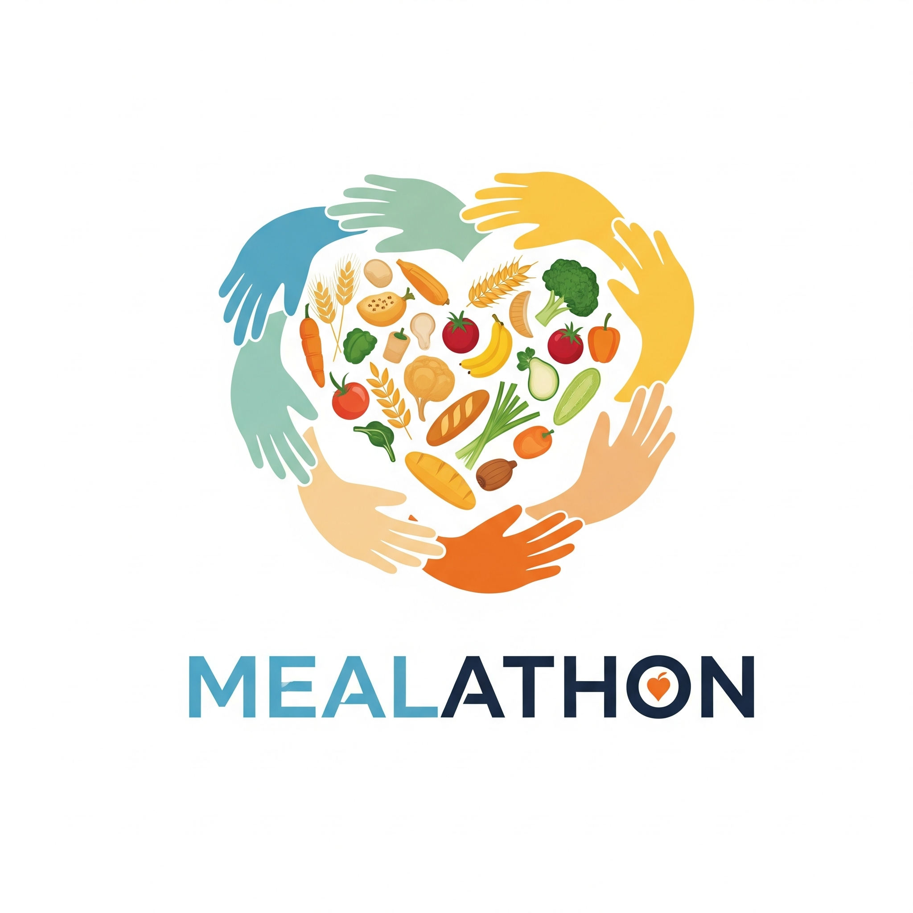

# Mealathon App



A meal donation platform for the community

## Project Description

The Mealathon App is a platform designed to connect restaurants and food providers with a community of donors to facilitate food donation campaigns for charity. Food providers can create campaigns, promising to deliver meals based on funds raised through donations. Donors can contribute to these campaigns and receive updates on the distribution of meals within the community.

## Features

* **Campaign Creation:** Food providers can easily set up new charity campaigns, defining the campaign name, restaurant name, cost per meal, end date, and a detailed description.

* **Donation System:** Donors can contribute funds to active campaigns. The app tracks total donations for each campaign in real-time.

* **Estimated Meals Calculation:** Automatically calculates the estimated number of meals that can be provided based on the funds collected and the cost per meal.

* **Distribution Updates:** Providers can post updates on how and where the donated meals were distributed, ensuring transparency for donors.

* **User Dashboards:**

    * **Provider Dashboard:** Allows food providers to manage their created campaigns and post distribution updates.

    * **Donor Dashboard:** Enables donors to view their past contributions.

* **Real-time Data:** Leverages Firebase Firestore's real-time capabilities to ensure all campaign and donation data is up-to-date across all users.

* **Responsive Design:** Built with Tailwind CSS for a clean, modern, and adaptive user interface across various devices.

## Technologies Used

* **Frontend:** React.js (with Vite)

* **Styling:** Tailwind CSS

* **Database & Backend Services:** Google Firebase (Firestore, Authentication)

* **Package Manager:** npm (or Yarn)

## Getting Started

Follow these steps to set up and run the Mealathon App locally on your machine.

### Prerequisites

Before you begin, ensure you have the following installed:

* **Node.js:** [Download & Install Node.js](https://nodejs.org/) (includes npm)

* **npm:** (Comes with Node.js) or **Yarn:** `npm install -g yarn`

* **Git:** [Download & Install Git](https://git-scm.com/downloads) (for cloning the repository)

### Firebase Setup

The app uses Google Firebase for its backend. You need to set up a Firebase project, enable Firestore, configure security rules, and enable anonymous authentication.

1.  **Create a Firebase Project:**

    * Go to the [Firebase Console](https://console.firebase.google.com/).

    * Click **"Add project"** or **"Create a project"**.

    * Enter a **Project Name** (e.g., `Mealathon App`).

    * Follow the prompts to create the project.

2.  **Add a Web App to Your Firebase Project:**

    * Once your project is created, navigate to your project's **Project Overview** page.

    * Click on the **"Web" icon (`</>`)** to add a web app.

    * Enter an **App Nickname** (e.g., `Mealathon Local`).

    * Click **"Register app"**.

    * **Copy the entire `firebaseConfig` object** that Firebase provides. It will look like this:

        ```javascript
        const firebaseConfig = {
          apiKey: "YOUR_API_KEY",
          authDomain: "YOUR_AUTH_DOMAIN",
          projectId: "YOUR_PROJECT_ID",
          storageBucket: "YOUR_STORAGE_BUCKET",
          messagingSenderId: "YOUR_MESSAGING_SENDER_ID",
          appId: "YOUR_APP_ID",
          measurementId: "YOUR_MEASUREMENT_ID" // Optional
        };
        ```

    * Keep this configuration handy; you'll use it in the `.env.local` file.

    * Click **"Continue to console"**.

3.  **Enable Firestore Database:**

    * In the Firebase Console, navigate to **"Build" > "Firestore Database"** in the left-hand menu.

    * Click the **"Create database"** button.

    * Select **"Start in production mode"**.

    * Choose a Cloud Firestore location (e.g., `nam5 (us-central)`).

    * Click **"Enable"**.

4.  **Configure Firestore Security Rules:**

    * In the Firestore Database section, click on the **"Rules"** tab.

    * **Replace any existing rules** with the following code. These rules allow authenticated users to read and write public campaign data, and users to read/write their own private donation data.

        ```firestore
        rules_version = '2';
        service cloud.firestore {
        match /databases/{database}/documents {

                // Public data for campaigns
                // Allow any authenticated user to read campaigns
                // Allow ANYONE to write (create/update/delete) campaigns for demonstration purposes.
                // WARNING: This is INSECURE for production apps.
                match /artifacts/{appId}/public/data/campaigns/{campaignId} {
                allow read: if request.auth != null;
                allow write: true; // This allows anyone to write
                }

                // Private data for user donations
                // Users can only read and write their own donations
                match /artifacts/{appId}/users/{userId}/{document=**} {
                allow read, write: if request.auth != null && request.auth.uid == userId;
                }
            }
        }
        ```

    * Click the **"Publish"** button to deploy these rules.

5.  **Enable Anonymous Authentication:**

    * In the Firebase Console, navigate to **"Build" > "Authentication"** in the left-hand menu.

    * If it's your first time, click **"Get started"**.

    * Go to the **"Sign-in method"** tab.

    * Find **"Anonymous"** in the list of providers.

    * Click the **pencil icon** next to "Anonymous".

    * **Toggle the switch to "Enable"** it.

    * Click **"Save"**.

### Local Development Setup

1.  **Clone the Repository:**

    ```bash
    git clone https://github.com/bonafide-ptnguyen/Mealathon.git
    cd mealathon-vite-app # Navigate into your project directory
    ```

    *(If you've been following the previous steps, you might already have the project directory. Just ensure you're in the correct one.)*

2.  **Install Project Dependencies:**

    ```bash
    npm install
    # OR
    yarn install
    ```

3.  **Install Tailwind CSS and the Vite Plugin:**

    ```bash
    npm install -D tailwindcss @tailwindcss/vite
    # OR
    yarn add -D tailwindcss @tailwindcss/vite
    ```
8.  **Create `.env.local` for Firebase Keys:**

    * In the **root directory** of your project, create a new file named `.env.local`.

    * Paste your `firebaseConfig` values (copied from Firebase Step 2) into this file, prefixed with `VITE_` and without quotes (unless the value itself contains spaces or special characters):

        ```
        VITE_FIREBASE_API_KEY=YOUR_API_KEY
        VITE_FIREBASE_AUTH_DOMAIN=YOUR_AUTH_DOMAIN
        VITE_FIREBASE_PROJECT_ID=YOUR_PROJECT_ID
        VITE_FIREBASE_STORAGE_BUCKET=YOUR_STORAGE_BUCKET
        VITE_FIREBASE_MESSAGING_SENDER_ID=YOUR_MESSAGING_SENDER_ID
        VITE_FIREBASE_APP_ID=YOUR_APP_ID
        VITE_FIREBASE_MEASUREMENT_ID=YOUR_MEASUREMENT_ID
        ```

    * *Replace `YOUR_...` placeholders with your actual keys.*

9.  **Update `.gitignore`:**

    * Open your `.gitignore` file in the project root.

    * Add (or ensure it already contains) the following line to prevent `.env.local` from being committed:

        ```gitignore
        # Local environment variables
        .env.local
        ```

    * You can also add other common ignorable files as provided in previous responses.

### Running the Application

Once all the setup steps are complete:

####  **Start the Development Server:**

    * In your terminal, navigate to your project's root directory (`mealathon-vite-app`).

    * Run the development server:

        ```bash
        npm run dev
        # OR
        yarn dev
        ```

    * The application will typically open in your browser at `http://localhost:5173` (or a similar port).

## Usage

* **View Campaigns:** The homepage displays all active food donation campaigns.

* **Create a Campaign:** Click "+ Create New Campaign" to set up a new campaign as a food provider.

* **Donate:** Click on any campaign card to view details and make a donation.

* **My Campaigns:** Access your created campaigns from the navigation bar to manage them and post distribution updates.

* **My Donations:** View a history of your donations from the navigation bar.

## Contributing

Contributions are welcome! Please feel free to open issues or submit pull requests.

## License

This project is open-source and available under the [MIT License](https://www.google.com/search?q=LICENSE).